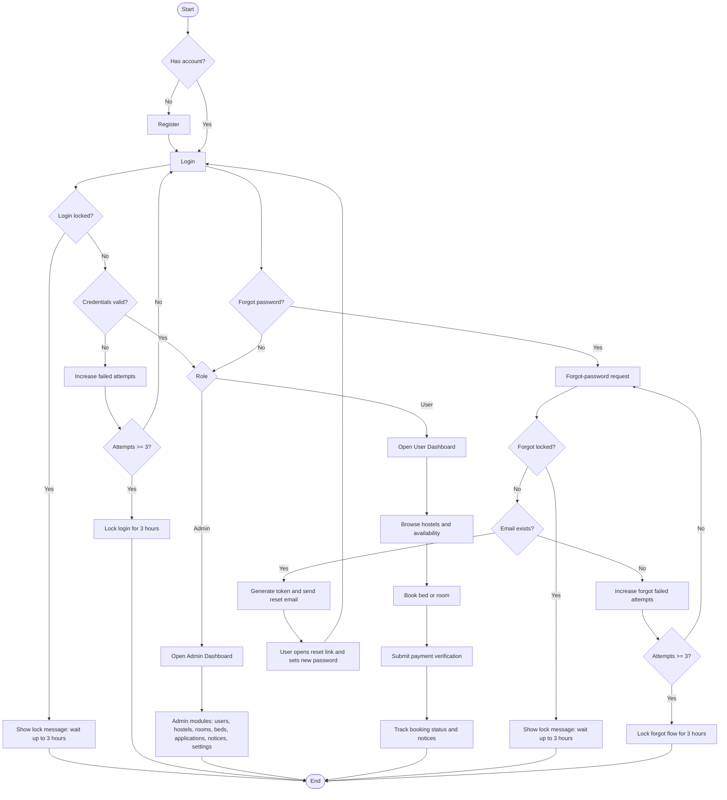

# HostelPro Flow Diagram

```mermaid
flowchart TD
    S([Start]) --> G{Has account?}

    G -- No --> R[Register]
    R --> L[Login]

    G -- Yes --> L

    L --> T1{Login locked?}
    T1 -- Yes --> W1[Show lock message: wait up to 3 hours]
    W1 --> E([End])
    T1 -- No --> C1{Credentials valid?}
    C1 -- No --> F1[Increase failed attempts]
    F1 --> T2{Attempts >= 3?}
    T2 -- Yes --> K1[Lock login for 3 hours]
    K1 --> E
    T2 -- No --> L

    C1 -- Yes --> RB{Role}
    RB -- Admin --> AD[Open Admin Dashboard]
    RB -- User --> UD[Open User Dashboard]

    AD --> AM[Admin modules: users, hostels, rooms, beds, applications, notices, settings]
    AM --> E

    UD --> U1[Browse hostels and availability]
    U1 --> U2[Book bed or room]
    U2 --> U3[Submit payment verification]
    U3 --> U4[Track booking status and notices]
    U4 --> E

    L --> FP{Forgot password?}
    FP -- Yes --> FPL[Forgot-password request]
    FP -- No --> RB

    FPL --> T3{Forgot locked?}
    T3 -- Yes --> W2[Show lock message: wait up to 3 hours]
    W2 --> E
    T3 -- No --> EM{Email exists?}
    EM -- No --> F2[Increase forgot failed attempts]
    F2 --> T4{Attempts >= 3?}
    T4 -- Yes --> K2[Lock forgot flow for 3 hours]
    K2 --> E
    T4 -- No --> FPL
    EM -- Yes --> SEND[Generate token and send reset email]
    SEND --> RESET[User opens reset link and sets new password]
    RESET --> L
```
