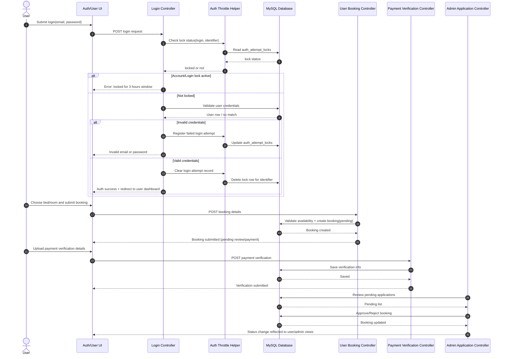

# HostelPro Sequence Diagram

## User Login and Booking Sequence

```mermaid
sequenceDiagram
    autonumber
    actor User
    participant UI as Auth/User UI
    participant LoginC as Login Controller
    participant Throttle as Auth Throttle Helper
    participant DB as MySQL Database
    participant UserC as User Booking Controller
    participant PayC as Payment Verification Controller
    participant AdminC as Admin Application Controller

    User->>UI: Submit login(email, password)
    UI->>LoginC: POST login request
    LoginC->>Throttle: Check lock status(login, identifier)
    Throttle->>DB: Read auth_attempt_locks
    DB-->>Throttle: lock status
    Throttle-->>LoginC: locked or not

    alt Account/Login lock active
        LoginC-->>UI: Error: locked for 3 hours window
    else Not locked
        LoginC->>DB: Validate user credentials
        DB-->>LoginC: User row / no match
        alt Invalid credentials
            LoginC->>Throttle: Register failed login attempt
            Throttle->>DB: Update auth_attempt_locks
            LoginC-->>UI: Invalid email or password
        else Valid credentials
            LoginC->>Throttle: Clear login attempt record
            Throttle->>DB: Delete lock row for identifier
            LoginC-->>UI: Auth success + redirect to user dashboard
        end
    end

    User->>UI: Choose bed/room and submit booking
    UI->>UserC: POST booking details
    UserC->>DB: Validate availability + create booking(pending)
    DB-->>UserC: Booking created
    UserC-->>UI: Booking submitted (pending review/payment)

    User->>UI: Upload payment verification details
    UI->>PayC: POST payment verification
    PayC->>DB: Save verification info
    DB-->>PayC: Saved
    PayC-->>UI: Verification submitted

    AdminC->>DB: Review pending applications
    DB-->>AdminC: Pending list
    AdminC->>DB: Approve/Reject booking
    DB-->>AdminC: Booking updated
    AdminC-->>UI: Status change reflected to user/admin views
```
