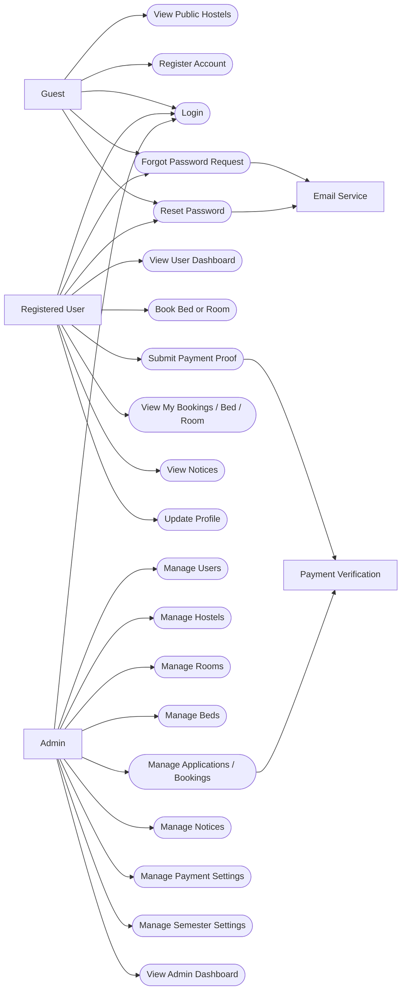

# HostelPro Use Case Diagram

```mermaid
flowchart LR
    G[Guest]
    U[Registered User]
    A[Admin]
    M[Email Service]
    P[Payment Verification]

    UC1([View Public Hostels])
    UC2([Register Account])
    UC3([Login])
    UC4([Forgot Password Request])
    UC5([Reset Password])
    UC6([View User Dashboard])
    UC7([Book Bed or Room])
    UC8([Submit Payment Proof])
    UC9([View My Bookings / Bed / Room])
    UC10([View Notices])
    UC11([Update Profile])

    AC1([Manage Users])
    AC2([Manage Hostels])
    AC3([Manage Rooms])
    AC4([Manage Beds])
    AC5([Manage Applications / Bookings])
    AC6([Manage Notices])
    AC7([Manage Payment Settings])
    AC8([Manage Semester Settings])
    AC9([View Admin Dashboard])

    G --> UC1
    G --> UC2
    G --> UC3
    G --> UC4
    G --> UC5

    U --> UC3
    U --> UC6
    U --> UC7
    U --> UC8
    U --> UC9
    U --> UC10
    U --> UC11
    U --> UC4
    U --> UC5

    A --> UC3
    A --> AC1
    A --> AC2
    A --> AC3
    A --> AC4
    A --> AC5
    A --> AC6
    A --> AC7
    A --> AC8
    A --> AC9

    UC4 --> M
    UC5 --> M
    UC8 --> P
    AC5 --> P
```
